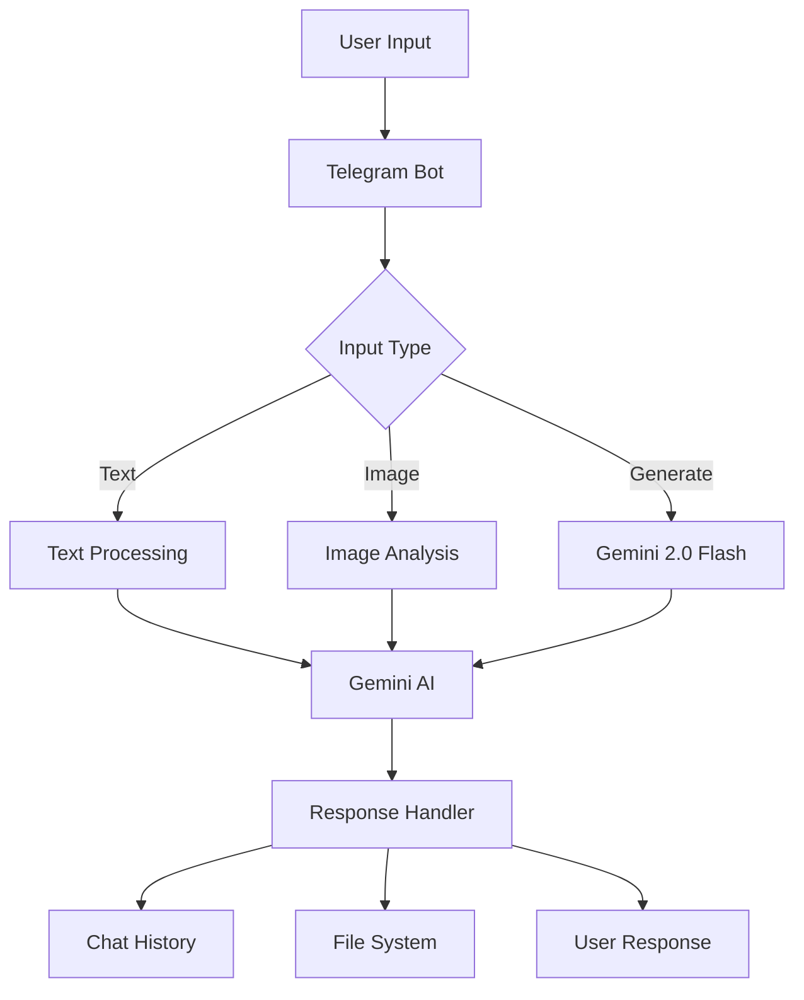

<div align="center">


# 🤖 Gemini AI Telegram Bot

[](https://nodejs.org)
[](https://opensource.org/licenses/MIT)

A powerful Telegram bot powered by Google's Gemini 2.0 Flash for natural conversations and stunning AI image generation with multimodal capabilities.

</div>

---

## 🌟 Features

- **Advanced Image Generation**: Create stunning images using Gemini 2.0 Flash's native image generation capabilities
  - Consistent character and setting representation across multiple generated images
  - Superior text rendering in generated images
  - Conversational image editing through natural dialogue
  - Accurate representation of complex concepts using world knowledge
- **Natural Conversation**: Engage in fluid, context-aware conversations with Gemini AI
- **Image Analysis**: Send any image for AI-powered analysis and insights
- **Smart History**: Maintains chat history for more contextual responses
- **True Multi-Modal Interaction**: Seamlessly process text and images in the same conversation

## 🎨 Image Generation Capabilities

### 1. Storytelling with Illustrations

Generate consistent visual narratives where characters and settings remain cohesive throughout multiple images.

### 2. Iterative Image Creation

Fine-tune generated images through natural conversation, allowing for precise adjustments and creative exploration.

### 3. Knowledge-Informed Generation

Create detailed, accurate images backed by Gemini's understanding of real-world concepts - perfect for technical illustrations or educational content.

### 4. Superior Text Integration

Generate images with crisp, accurate text rendering - ideal for creating:

- Social media posts
- Advertisements
- Event invitations
- Infographics

## 🚀 Prerequisites

- Node.js (v18 or newer)
- A Telegram Bot Token from [@BotFather](https://t.me/BotFather)
- A Google Gemini API Key from [Google AI Studio](https://aistudio.google.com/)

## 💻 Setup

1. **Clone & Install**

   ```bash
   git clone https://github.com/jiaweing/GeminiTelegramBot
   cd GeminiTelegramBot
   pnpm install
   ```

2. **Configure Environment**

   ```bash
   cp .env.example .env
   ```

   Edit `.env` with your tokens:

   ```env
   BOT_TOKEN=your_telegram_bot_token
   GEMINI_API_KEY=your_gemini_api_key
   ```

3. **Start the Bot**
   ```bash
   pnpm dev
   ```

## 🎯 Commands

- `/start` - Initialize or reset the bot
- `/help` - View usage instructions
- `/clear` - Clear conversation history
- Type `clear` - Alternative way to reset chat

## 🎨 Example Prompts

### Image Generation

- **Storytelling**

  ```
  generate: Tell a story about a cute baby turtle's adventure with illustrations in 3D digital art style
  ```

- **Iterative Design**

  ```
  generate: A cozy coffee shop interior
  [Then refine with]: Make it more modern with large windows
  [And further]: Add some plants and wooden elements
  ```

- **Technical Visualization**

  ```
  generate: Step-by-step illustration of how a solar panel works
  ```

- **Text-Rich Images**
  ```
  generate: Create a modern event poster for a tech conference with the title "Future of AI 2025" and all the important details
  ```

### Image Analysis

- Send any image with prompts like:
  - "What's unique about this architectural style?"
  - "Can you analyze the composition of this photograph?"
  - "What emotions does this artwork convey?"

### Natural Conversations

- "Explain quantum computing with visual examples"
- "Design a logo for an eco-friendly startup"
- "Create a visual story about space exploration"

## 🛠️ Technical Architecture



## 🔧 Development Stack

- **Framework**: [Telegraf](https://telegraf.js.org/) for Telegram Bot API
- **AI Engine**: [@google/genai](https://www.npmjs.com/package/@google/genai) for Gemini integration
  - Uses Gemini 2.0 Flash experimental model for enhanced image generation
- **Language**: TypeScript for type safety and better development experience
- **Runtime**: Node.js with support for modern ES modules

## 📝 Error Handling

The bot includes comprehensive error handling for:

- Network connectivity issues
- API rate limits and timeouts
- Invalid input formats
- File system operations
- AI processing errors

## 🤝 Contributing

Contributions are welcome! Please feel free to submit a Pull Request.

## 📜 License

MIT
